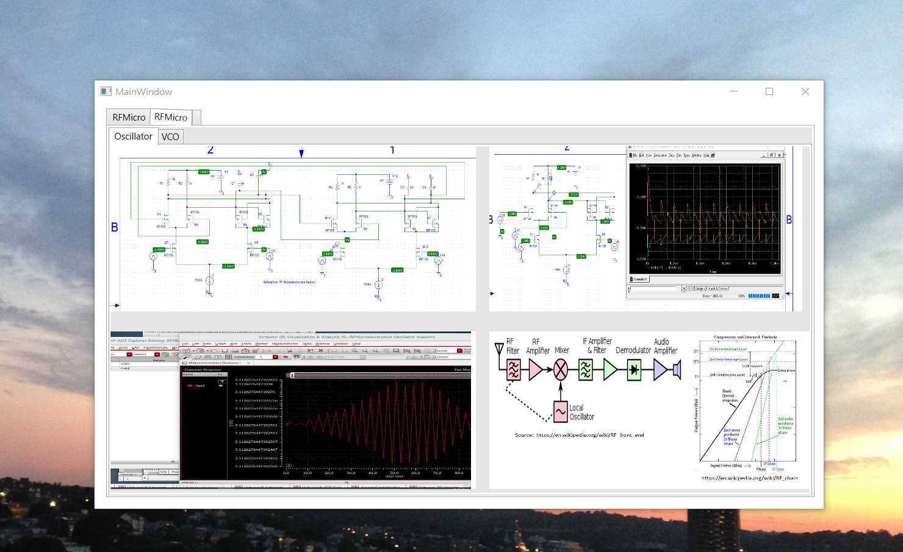
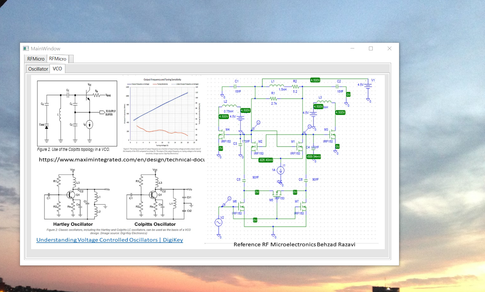
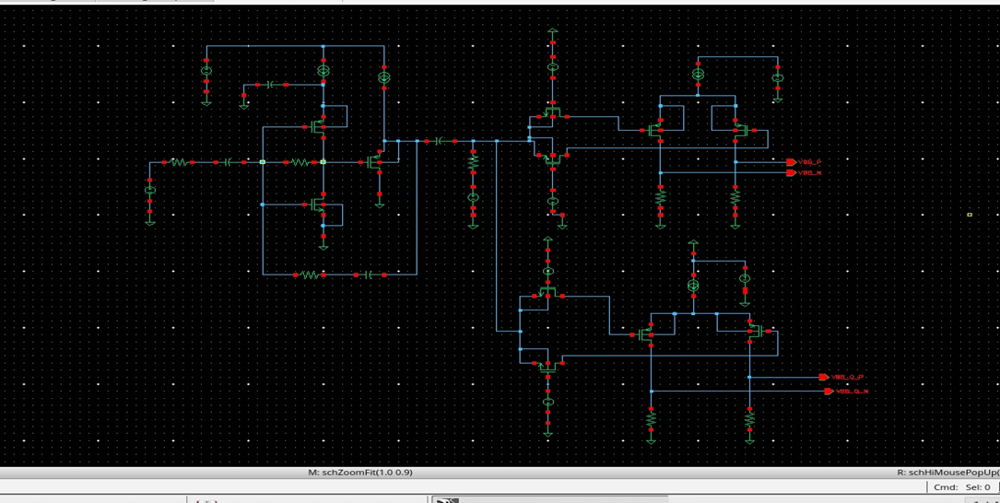
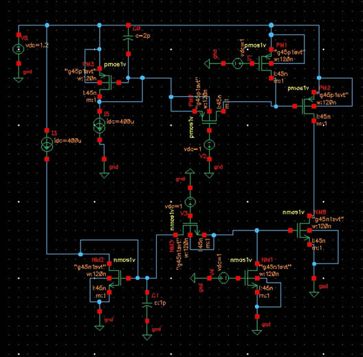

# RF Microelectronics

The project provides details on RF microelectronics

All images are custom unless a reference is specified.

## RF Microelectronics LNA

## RF Microelectronics Mixer

## RF Microelectronics Oscillator

## RF Microelectronics Voltage Controlled Oscillator

## Final Transmitter Design 

## Final Receiver Design

## Voltage Controlled Oscillator

## Charge pump

###### Reference for circuits: RF Microelectronics Razavi.

Additional details reference https://github.com/alpaddesai/ArchitecturalProductDesign
